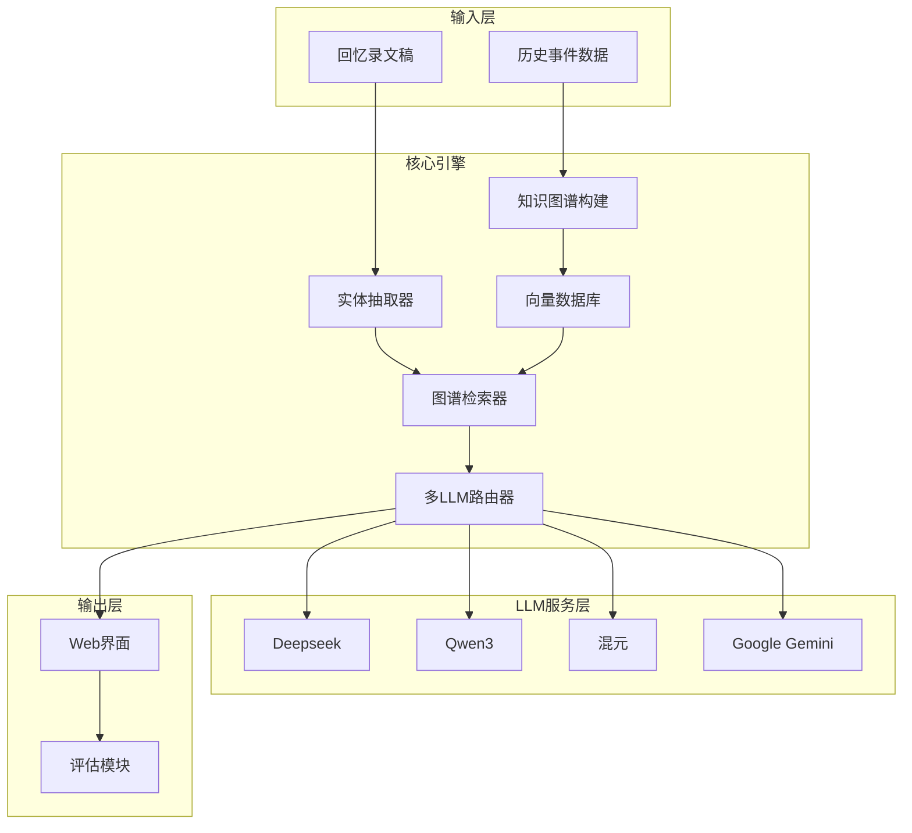

# GraphRAG 记忆模块开发计划

## 项目架构



## 技术栈

| 组件 | 技术选型 |

|------|----------|

| GraphRAG框架 | Microsoft GraphRAG |

| 图数据库 | LanceDB (GraphRAG内置) |

| 向量数据库 | GraphRAG内置向量存储 |

| Web框架 | FastAPI + Gradio/Streamlit |

| LLM集成 | LiteLLM (统一多模型接口) |

## 开发阶段

### 阶段一：环境搭建与GraphRAG集成

1. 初始化Python项目，安装Microsoft GraphRAG
2. 配置多LLM支持（Deepseek、Qwen3、混元、Gemini）
3. 创建统一的LLM适配器层

### 阶段二：历史知识图谱构建

1. 定义历史事件实体类型（时间、地点、人物、事件）
2. 配置GraphRAG的实体抽取提示词
3. 实现索引构建流程，处理其他组员提供的历史数据
4. 构建社区检测和摘要生成

### 阶段三：检索与生成模块

1. 实现回忆录文本解析（提取日期/地点/关键词）
2. 开发图谱检索逻辑（本地检索 + 全局检索）
3. 设计文学润色提示词模板
4. 实现多LLM并行生成对比

### 阶段四：Web应用开发

1. 构建FastAPI后端服务
2. 开发Gradio/Streamlit前端界面
3. 实现输入（回忆录文稿）→ 输出（历史背景文本）流程
4. 添加LLM选择和参数配置界面

### 阶段五：评估体系

1. 实现事实准确性评估（与知识库对比）
2. 实现相关性评估（语义相似度计算）
3. 设计文学性人工评估问卷
4. 生成对比评估报告

## 项目目录结构

```
GraphRAG/
├── src/
│   ├── config/           # 配置文件
│   ├── llm/              # 多LLM适配器
│   ├── indexing/         # 知识图谱构建
│   ├── retrieval/        # 检索模块
│   ├── generation/       # 文本生成
│   └── evaluation/       # 评估模块
├── data/
│   ├── input/            # 历史数据输入
│   └── output/           # 索引输出
├── web/                  # Web应用
├── tests/                # 测试用例
├── requirements.txt
└── README.md
```

## 关键文件说明

- `src/llm/adapter.py` - 统一的多LLM接口，支持切换不同模型
- `src/indexing/graph_builder.py` - 调用GraphRAG构建历史事件知识图谱
- `src/retrieval/memoir_retriever.py` - 从回忆录提取查询，检索相关历史背景
- `src/generation/literary_generator.py` - 使用LLM生成文学性描述
- `web/app.py` - Gradio/Streamlit Web应用入口